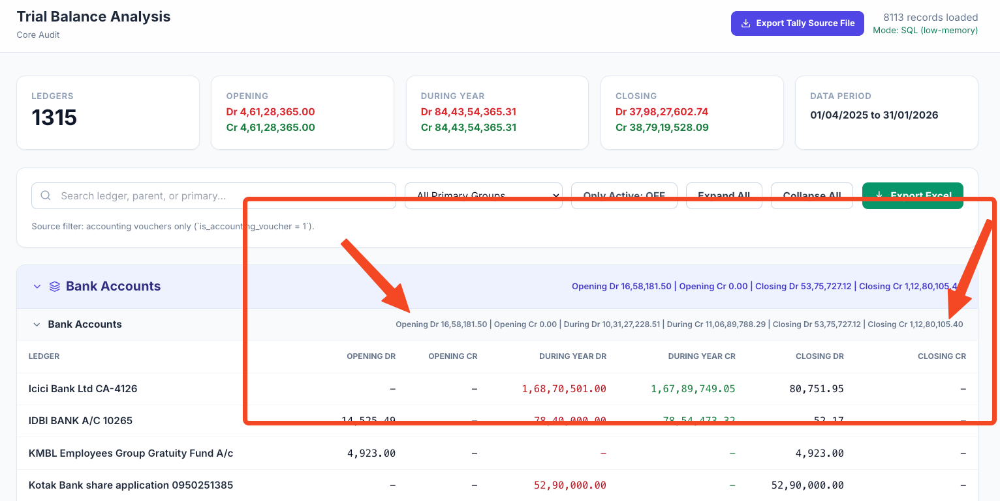

<div align="center">

# FinAnalyzer

### The Audit Powerhouse for Tally Prime — Built by a CA, for CAs

[](https://github.com/dhruvdua88/FinAnalyzer-CSV-Version/releases)
[](app/LICENSE)
[](#download)
[](#data--privacy)
[](#all-24-modules)

**One-click import from Tally → Run 24 specialized audit modules → Export audit-ready Excel working papers. 100% local. Zero telemetry. No cloud.**

[⬇️ Download Now](#download) · [Quick Start (5 min)](#quick-start-no-coding-required) · [All 24 Modules](#all-24-modules) · [Developer Setup](#developer-setup)

---


*Trial Balance Analysis — 8,113 records loaded in SQL mode*

</div>

---

## Download

> **Standalone build — unzip and run. No Node.js install required.**

| Platform | Download |
|---|---|
| **Windows 10 / 11** (x64) | [⬇️ FinAnalyzer-windows-x64.zip](https://github.com/dhruvdua88/FinAnalyzer-CSV-Version/releases/latest/download/FinAnalyzer-windows-x64.zip) |
| **macOS** (Apple Silicon M1–M4) | [⬇️ FinAnalyzer-macos-arm64.zip](https://github.com/dhruvdua88/FinAnalyzer-CSV-Version/releases/latest/download/FinAnalyzer-macos-arm64.zip) |
| **macOS** (Intel) | [⬇️ FinAnalyzer-macos-x64.zip](https://github.com/dhruvdua88/FinAnalyzer-CSV-Version/releases/latest/download/FinAnalyzer-macos-x64.zip) |
| **All releases & source** | [github.com/dhruvdua88/FinAnalyzer-CSV-Version/releases](https://github.com/dhruvdua88/FinAnalyzer-CSV-Version/releases) |

**Windows:** Unzip → double-click `FinAnalyzer.exe`  
**macOS:** Unzip → right-click `Run FinAnalyzer.command` → **Open** (first time only, to bypass Gatekeeper)

> Keep the `app/` folder next to the executable — it contains the interface and is required at runtime.

---

## What Is FinAnalyzer?

FinAnalyzer is a desktop audit utility that connects directly to **Tally Prime** and turns your books into structured, reviewable, exportable audit working papers — in minutes, not days.

If you've ever:
- Spent an evening pivoting the Day Book in Excel to check TDS coverage
- Manually matched GSTR-2B against your Purchase Register row by row
- Tried to figure out which Sundry Creditor is missing RCM
- Built an ageing schedule by hand because Tally's built-in one is wrong

…this tool was built specifically for you.

### Why it exists

Tally is the most-used accounting software in India. But it has no audit layer. FinAnalyzer adds one — a set of 24 focused analysis modules that work with any Tally company, no customizations, no add-ons, no Tally consultant required.

---

## All 24 Modules

| Category | Module | What it does |
|---|---|---|
| **Setup** | Dashboard Overview | Summary cards: total vouchers, date range, data mode |
| **Setup** | Audit Configuration Manager | Map ledgers to GST/TDS/RCM categories; save profiles per period |
| **Core Audit** | Accounting Ledger Analytics | Ledger-wise balances, turnover, and variance across groups |
| **Core Audit** | Voucher Book View | Full day book with Dr/Cr detail; search by narration, party, amount |
| **Core Audit** | Ledger Statement | Opening balance → all movements → closing for any ledger |
| **Core Audit** | **Party Ledger Matrix** ⭐ | Party-wise Sales / Purchase / Expense / TDS / GST / RCM breakdown |
| **Core Audit** | Related Party (RPT) Analysis | AS-18 classification, approval status, transaction materiality |
| **Core Audit** | Trial Balance Analysis | Group-wise and ledger-wise TB with opening / movement / closing |
| **Ageing** | Debtor Ageing (FIFO) | True FIFO bucket ageing for receivables (0–30 / 30–60 / 60–90 / 90+) |
| **Ageing** | Creditor Ageing (FIFO) | True FIFO bucket ageing for payables |
| **GST & Tax** | GST Rate Analysis | Validate GST rates on sales ledgers against expected category |
| **GST & Tax** | Sales Register | Invoice-level sales detail with HSN, GST rate, party GSTIN |
| **GST & Tax** | Purchase GST Register | Purchase-level detail with RCM flag, eligible ITC, blocked credit |
| **GST & Tax** | **GSTR-2B Reconciliation** ⭐ | Upload portal JSON → matched / unmatched / rate-mismatch buckets |
| **GST & Tax** | ITC vs 3B Reconciliation | Books ITC vs GSTR-3B filed — row by row comparison |
| **GST & Tax** | GST Ledger Summary | Ledger-wise GST constitution (CGST / SGST / IGST / Cess) |
| **GST & Tax** | GST Expense Analysis | Blocked credit items, ineligible ITC, Section 17(5) violations |
| **GST & Tax** | **TDS Analysis** ⭐ | Section-wise (194C / 194J / 194Q / 194H / 194A …) compliance + thresholds |
| **GST & Tax** | RCM Analysis | Reverse charge liability — voucher-level RCM entries vs. expected |
| **Analytics** | Profit & Loss Analysis | P&L trends period-over-period with % movement |
| **Analytics** | Cash Flow Analysis | Cash pool movement with accounting-format CF statement |
| **Analytics** | Variance Analysis | Month-on-month % variance with spike detection |
| **Analytics** | Exception Density Heatmap | Visual concentration of exceptions by ledger and period |
| **Analytics** | Balance Sheet Cleanliness | Hygiene diagnostics — stale entries, long-outstanding items, mis-groups |

> ⭐ = Flagship modules. Start here.

Every module outputs an **audit-ready Excel workbook**: frozen header row, colour-coded amounts, totals row, observations block — ready to paste into a file note.

---

## Quick Start (no coding required)

### Step 1 — Download

Use one of the download links above, or click the green **Code** button → **Download ZIP** if you want the source.

### Step 2 — One-time Node.js install *(source only — skip if using the .exe)*

1. Go to [nodejs.org](https://nodejs.org) and install the **LTS** version (keep all defaults).
2. Reboot.

### Step 3 — Launch

| OS | Action |
|---|---|
| Windows | Double-click **`Start FinAnalyzer (Windows).bat`** |
| macOS | Double-click **`Start FinAnalyzer (Mac).command`** |

The first run installs dependencies (~3–5 min). After that, the app opens at `http://127.0.0.1:5173` in your browser automatically.

> **Leave the terminal window open** while you work. Closing it stops the app.

### Step 4 — Connect Tally *(optional — skip if using TSF files)*

In Tally Prime:
1. `F1 → Settings → Connectivity → Client/Server configuration`
2. Set **TallyPrime is acting as: Both** · **Enable ODBC: Yes** · **Port: 9000**

Quick test: open `http://localhost:9000` in a browser. If you see XML, FinAnalyzer will connect.

Then install the Tally loader utility (one-time, ~15 MB):

1. Download: [`tally-database-loader-utility-1.0.42.7z`](https://excelkida.com/resource/tally-database-loader-utility-1.0.42.7z)
2. Extract with [7-Zip](https://www.7-zip.org/) (Windows) or [The Unarchiver](https://theunarchiver.com/) (macOS)
3. **Rename the folder** to exactly `tally-database-loader-main`
4. Place it inside the `app/` folder

Final layout:
```
app/
├── tally-database-loader-main/   ← renamed folder here
│   ├── dist/index.mjs
│   └── config.json
├── package.json
└── …
```

5. Restart FinAnalyzer. The "Loader not found" warning disappears.

### Step 5 — Import your data (3 ways)

| Method | When to use |
|---|---|
| **Import from Tally** | Tally is open on the same machine (or LAN) — fastest |
| **Import TSF file** | A colleague already exported a `.TSF` — just upload it |
| **TSF Raw to Excel** | You only want flat CSV sheets, no analysis |

### Step 6 — Run any module

Click a module in the left sidebar → set date range / ledger filters → review the table → click **Export Beautiful Excel** (top-right).

### Step 7 — Stop

| OS | Action |
|---|---|
| Windows | Double-click **`Stop FinAnalyzer (Windows).bat`** |
| macOS | Press `Ctrl+C` in the terminal, then close it |

---

## System Requirements

| | Minimum | Recommended |
|---|---|---|
| **OS** | Windows 10 or macOS 12 | Windows 11 or macOS 14 |
| **RAM** | 8 GB | 16 GB (for 100k+ vouchers/year) |
| **Disk** | 2 GB free | 4 GB free |
| **Tally** | Any recent Tally Prime | Tally Prime 3.x |
| **Node.js** | LTS (source mode only) | LTS (source mode only) |

---

## Flagship Modules — Deep Dive

### Party Ledger Transaction Matrix

The most powerful module. For every party in Sundry Debtors / Sundry Creditors / any group you choose, it builds a single-row summary:

| Column | What it shows |
|---|---|
| Total Sales | Revenue booked through this party |
| Total Purchase | Purchases from this party |
| Total Expense | Expense vouchers posted to this party |
| TDS Deducted | TDS entries linked to this party |
| TDS / Expense % | Instant flag if under-deduction |
| GST Amount | GST collected or paid |
| GST / Sales % | Rate check |
| RCM | Reverse charge entries |
| Bank / Cash | Payment and receipt legs |
| Net Balance | Outstanding after all movements |

TDS and GST ledgers aren't tagged in Tally by default. The module lets you tick which ledgers count as TDS / GST / RCM, with auto-suggest. That mapping is saved as a **Profile JSON** — reusable across periods and entities.

---

### GSTR-2B Reconciliation

1. Download your GSTR-2B JSON from the GST portal
2. Upload it in FinAnalyzer
3. The module matches every record against your Purchase Register

**Output buckets:**
- ✅ Matched (GSTIN + invoice number + date + amount)
- 📗 Only in Books (ITC claimed but not in 2B — risky)
- 📘 Only in 2B (supplier filed, you haven't booked)
- ⚠️ Rate Mismatch (amount or tax rate differs)
- 🕐 Date Tolerance Matches (same invoice, date shifted ±3 days)

Exports a 9-sheet Excel: Summary, Action Required, Full Detail, GSTIN-wise, Month-wise, and more.

---

### TDS Analysis

Section-wise coverage across:
`194C` (Contractors) · `194J` (Professionals) · `194H` (Commission) · `194I` (Rent) · `194A` (Interest) · `194Q` (Purchase) · `194M` (Society) · `194O` (E-commerce) · `26Q` / `27Q`

For each expense ledger mapped to a TDS section:
- Per-voucher status: **Deducted** / **Short-deducted** / **Missed** / **Below threshold**
- Threshold comparison (configurable in Audit Setup)
- Effective TDS % per party
- Excel export with a full action list

---

### Debtor & Creditor Ageing (FIFO)

Tally's built-in ageing is wrong — it ages by invoice date, not by actual knockoff. FinAnalyzer uses **FIFO matching** (receipts against oldest invoices first) to produce accurate:

- 0–30 days · 31–60 days · 61–90 days · 91–180 days · 181–365 days · 365+ days

---

## Data & Privacy

| Question | Answer |
|---|---|
| Is data uploaded anywhere? | **Never.** No server, no API, no analytics. |
| Where is data stored? | In-memory during the session, or local `audit.sqlite` (never leaves your machine) |
| Does it phone home? | No license server, no crash reporting, no telemetry of any kind. |
| Is client data safe to use? | Yes. The `.gitignore` also blocks TSF files, GSTR JSON, and PDFs from being committed. |

---

## Troubleshooting

| Symptom | Fix |
|---|---|
| `npm` not recognised | Node.js not installed. Re-run installer from [nodejs.org](https://nodejs.org) and **reboot**. |
| Browser shows "site can't be reached" at `127.0.0.1:5173` | Terminal was closed. Re-run the Start launcher. |
| Import from Tally returns 0 records | Check Tally port 9000, confirm a company is loaded, run the connectivity checklist above. |
| "Loader utility not found" after placing it | Confirm `dist/index.mjs` and `config.json` exist inside the renamed folder. |
| Export button does nothing (large company) | 500k+ vouchers can take 30–60 s. Watch the terminal for progress. |
| First run stuck on "installing" | `npm install` needs internet (~200 MB). Corporate proxies can block this — try on a personal connection. |
| Slow with 1M+ vouchers | Switch to **SQL (low-memory)** mode via the toggle on the top-right of each module. |

If the fix isn't here, open an [Issue](https://github.com/dhruvdua88/FinAnalyzer-CSV-Version/issues) with: **(a)** module name, **(b)** what you clicked, **(c)** screenshot of browser + terminal.

---

## Developer Setup

```bash
# 1. Clone
git clone https://github.com/dhruvdua88/FinAnalyzer-CSV-Version.git
cd FinAnalyzer-CSV-Version/app

# 2. Install
npm install

# 3. Develop
npm run dev          # Vite dev server at http://127.0.0.1:5173

# 4. Build
npm run build        # Production build → /dist

# 5. Test
npm run test:gstr2b  # GSTR-2B unit tests
node scripts/smoke-test-all-modules.mjs  # Smoke test all 24 modules
```

### Architecture Overview

```
app/
├── App.tsx                  # Module routing, settings state, data orchestration
├── types.ts                 # LedgerEntry (36+ fields), AuditSettings, all interfaces
├── index.tsx                # React 19 root + TanStack Query setup
├── vite.config.ts           # Dev server + API middleware + SQLite integration
│
├── components/
│   ├── FileUpload.tsx        # Tally import, TSF import/export, raw converter
│   └── modules/             # 24 self-contained .tsx files (one per module)
│
├── services/
│   ├── sqlDataService.ts     # SQLite abstraction (100k+ row optimizations)
│   ├── sqlAnalyticsService.ts # SQL query builders per module
│   └── tallyLoaderImportService.ts  # One-click loader orchestration
│
├── workers/
│   ├── tdsWorker.ts          # Web Worker: TDS calculations
│   ├── partyMatrixWorker.ts  # Web Worker: party matrix pivoting
│   ├── relatedPartyWorker.ts # Web Worker: RPT analysis
│   └── orphanPLWorker.ts     # Web Worker: orphan P&L detection
│
└── desktop-backend/
    ├── backend.cjs           # Express.js for SEA/desktop mode
    └── services/             # SQLite, GSTR-2B reconciliation (CJS)
```

**Data flow:**
```
Tally / TSF → FileUpload.tsx → normalize to LedgerEntry[] → SQLite or memory
                                                                    ↓
                                                         Module (filter + analyze)
                                                                    ↓
                                                         xlsx-js-style → Excel
```

**Adding a new module:**
1. Create `components/modules/YourModule.tsx` — accepts `data: LedgerEntry[]`
2. Register in `App.tsx` (add to `AnalysisType` enum, `MODULE_LABELS`, `MODULE_ICONS`, `MODULE_SECTIONS`)
3. Export styled Excel: freeze panes at header, totals in slate-900, observations block at bottom
4. Open a PR with a screenshot + sample exported Excel

---

## Contributing

Pull requests are welcome — especially from other CAs who've hit a real audit gap.

1. Fork the repo
2. `cd app && npm install && npm run dev`
3. Add your module under `components/modules/`
4. Run `npm run test:gstr2b` + smoke tests
5. Open a PR with a screenshot of the module UI and the exported Excel

See [`app/INSTRUCTIONS.md`](app/INSTRUCTIONS.md) for the full API contract, data conventions, and module extension checklist.

---

## Disclaimer

FinAnalyzer is an **aid** to the audit process, not a substitute for professional judgement. Always verify flagged exceptions against source documents before concluding. The authors accept no liability for reliance on the tool's output.

---

## Licence

MIT — see [`app/LICENSE`](app/LICENSE). Free to use in your practice, modify, and share — provided the copyright notice is retained.

---

<div align="center">

**Built by a CA, for CAs.**  
If it saves you an evening, pay it forward — file an issue with a feature idea or open a PR.

[⬇️ Download](https://github.com/dhruvdua88/FinAnalyzer-CSV-Version/releases/latest) · [Report a Bug](https://github.com/dhruvdua88/FinAnalyzer-CSV-Version/issues) · [Request a Feature](https://github.com/dhruvdua88/FinAnalyzer-CSV-Version/issues)

</div>
